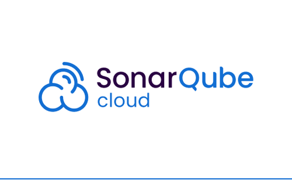

#  PiggyVault (Caveau Digitale)

> **Non-Custodial Time-Lock Savings Protocol on Polygon**

[](https://sonarcloud.io/summary/new_code?id=creazionecontenuti-oss_caveau-digitale)
[](https://snyk.io/test/github/creazionecontenuti-oss/caveau-digitale)
[](./SECURITY-AUDIT.md)
[](https://polygonscan.com/address/0x1FcbF2A6456aF7435c868666Be25774d92c2BA06#code)

A Progressive Web App that turns willpower into a mathematical constraint. Your savings are locked in a smart contract until the date you choose — nobody, not even you, can touch them before then.

**🌐 Live:** [piggyvault.xyz](https://piggyvault.xyz)

---

## What is it

PiggyVault is a personal interface for the **time-lock savings protocol** on Polygon. You can:

- Create multiple vaults with different goals (🏠 House, 🚗 Car, ✈️ Vacation, 💍 Wedding...)
- Set a target amount, unlock date, or both
- Choose between **Base Vault** (0% risk) or **Interest Vault** (~3-7% APY via Aave V3)
- Deposit stablecoins (USDC, DAI, USDT, EURe, ZCHF) directly or swap any ERC-20 token
- Send cross-chain from BTC, ETH, SOL, LTC, DOGE via SideShift
- Buy crypto with bank transfer or card via Mt Pelerin fiat on-ramp
- Withdraw to an external wallet or sell to your bank account (SEPA)
- Export your private key or seed phrase — your funds are always portable

## Philosophy

> *"It's not about willpower. It's about math."*

The smart contract responds with `REVERT` to every early withdrawal attempt. There is no human operator who can override it — not even the developer.

---

## Architecture

```
No server  •  No database  •  No middleman
```

| Component | Technology | Role |
|---|---|---|
| Frontend | HTML5 + Framework7 (iOS Liquid Glass / Material) | UI framework with native feel |
| Styling | TailwindCSS | Utility-first CSS |
| Wallet (seed) | ethers.js (BIP39) | In-browser seed phrase generation |
| Wallet (email) | Thirdweb In-App Wallet | Email OTP login with Shamir's Secret Sharing |
| Encryption | Web Crypto API (PBKDF2 + AES-GCM) | Local-only data encryption |
| Biometrics | WebAuthn / FIDO2 | Face ID / Touch ID for PIN-less access |
| Persistence | localStorage (encrypted) | Zero server-side storage |
| Smart Contract | CaveauDigitaleV2.sol / Polygon | 4 unlock modes (date/amount/OR/AND) |
| Yield | CaveauAave.sol / Aave V3 | Interest-bearing vaults (~3-7% APY) |
| Auto-Swap | Paraswap API v5 | Any ERC-20 → vault currency |
| Cross-Chain | SideShift API v2 | BTC/ETH/SOL/LTC/DOGE → USDC Polygon |
| Fiat On-Ramp | Mt Pelerin widget | Bank transfer / Card → crypto |
| Fiat Off-Ramp | Mt Pelerin widget | Crypto → SEPA bank transfer |
| i18n | Custom i18n engine | 11 languages (EN, DE, ES, FR, PT, IT, ZH, JA, KO, RU, HI) |
| Hosting | Vercel | Static deploy, zero cost |

## Smart Contracts

| Contract | Address | Description |
|---|---|---|
| **CaveauDigitaleV2** | [`0x1FcbF2A6456aF7435c868666Be25774d92c2BA06`](https://polygonscan.com/address/0x1FcbF2A6456aF7435c868666Be25774d92c2BA06) | Base savings vault — time-lock + amount-lock |
| **CaveauAave** | [`0xDF9c64E845C0E9D54175C7d567d5d0e0b9EE3501`](https://polygonscan.com/address/0xDF9c64E845C0E9D54175C7d567d5d0e0b9EE3501) | Yield vault — deposits earn interest via Aave V3 |

Both contracts are **non-upgradeable** and have **no admin functions**. Once deployed, nobody can modify them — not even the developer.

### Unlock Modes

| Mode | Condition | Description |
|---|---|---|
| `DATE_ONLY` | `block.timestamp >= unlockDate` | Opens at the chosen date |
| `AMOUNT_ONLY` | `totalDeposited >= targetAmount` | Opens when target is reached |
| `DATE_OR_AMT` | Either condition | Whichever comes first |
| `DATE_AND_AMT` | Both conditions | Both must be met |

### Supported Tokens

| Token | Address | Aave V3 |
|---|---|---|
| USDC (native) | `0x3c499c542cEF5E3811e1192ce70d8cC03d5c3359` | ✅ |
| DAI | `0x8f3Cf7ad23Cd3CaDbD9735AFf958023239c6A063` | ✅ |
| USDT | `0xc2132D05D31c914a87C6611C10748AEb04B58e8F` | ✅ |
| EURe | `0x18ec0A6E18E5bc3784fDd3a3634b31245ab704F6` | ❌ |
| ZCHF | `0x02567e4b14b25549331fcee2b56c647a8bab16fd` | ❌ |

## Security

- **Non-Custodial**: Private keys never leave the user's device
- **Two login methods**: Seed phrase (full self-custody) or Thirdweb email (Shamir's Secret Sharing)
- **Local PIN**: 6 digits encrypted with PBKDF2 (120,000 iterations) + AES-GCM 256-bit
- **Biometric auth**: Face ID / Touch ID via WebAuthn for PIN-less access
- **Encrypted vaults**: Vault metadata is encrypted with a key derived from the seed phrase
- **Private key export**: Thirdweb users can export their key or use the wallet address on any Polygon dApp
- **Zero trust**: The developer has no access to any user's data
- **Recovery**: Lost device → enter your 12 words → everything restored

### Security Audit

A comprehensive security audit has been performed using industry-standard tools. Full report: [`SECURITY-AUDIT.md`](./SECURITY-AUDIT.md)

#### Audited By

<p align="center">
  <a href="https://sonarcloud.io/summary/new_code?id=creazionecontenuti-oss_caveau-digitale"></a>
  &nbsp;&nbsp;&nbsp;
  <a href="https://snyk.io/test/github/creazionecontenuti-oss/caveau-digitale"></a>
  &nbsp;&nbsp;&nbsp;
  <a href="https://github.com/crytic/slither"></a>
  &nbsp;&nbsp;&nbsp;
  <a href="https://polygonscan.com/address/0x1FcbF2A6456aF7435c868666Be25774d92c2BA06#code"></a>
  &nbsp;&nbsp;&nbsp;
  <a href="https://github.com/aderyn-labs/aderyn"></a>
</p>

| Tool | Target | Result |
|---|---|---|
| **SonarCloud** | Full codebase (JS + Solidity) | ✅ Continuous analysis — Quality Gate Passed |
| **Snyk** | Dependencies + code | ✅ Continuous monitoring — No known vulnerabilities |
| **Slither** (Trail of Bits) | CaveauDigitaleV2.sol | ✅ 0 high, 0 medium |
| **Slither** (Trail of Bits) | CaveauAave.sol | ✅ 0 high, 4 medium (all mitigated/false positives) |
| **Polygonscan** | Both contracts | ✅ Source code verified on-chain |
| **ESLint + security plugin** | app.js | ✅ 0 errors, 64 warnings (all false positives) |
| **npm audit** | Dependencies | ✅ 1 moderate (legacy dep, not used at runtime) |
| **HTTP Security Headers** | vercel.json | ✅ HSTS, CSP, X-Frame-Options, etc. |

Run audits locally:
```bash
npm run audit:contracts   # Slither on both smart contracts
npm run lint              # ESLint with security plugin
npm run audit:deps        # npm dependency audit
```

## How It Works

1. **First launch**: Create a wallet (seed phrase or email login) → set up PIN → enable biometrics
2. **Create a vault**: Choose goal name/icon, target amount, currency, unlock date, and strategy (base or Aave yield)
3. **Fund it**: Deposit directly, swap any token, send from BTC/ETH, or buy with bank transfer
4. **Wait**: The countdown ticks. Math does the rest.
5. **Withdraw**: When unlocked, withdraw to your wallet or sell to your bank account via SEPA

## Install as PWA

**iPhone (Safari):** Open the link → Share → "Add to Home Screen"  
**Android (Chrome):** Open the link → Menu → "Add to Home Screen"

Opens fullscreen, works offline, no App Store required.

## Local Development

```bash
git clone https://github.com/creazionecontenuti-oss/caveau-digitale
cd caveau-digitale
npm install
python3 -m http.server 8080
# Open http://localhost:8080
```

### Build Commands

```bash
# Minify app.js
npx terser app.js --compress passes=2 --mangle --output app.min.js

# Rebuild Tailwind CSS
npx tailwindcss -i tailwind-input.css -o tailwind.min.css --minify

# Bundle Thirdweb SDK
npm run build:thirdweb
```

## Deploy

```bash
# Production deploy to Vercel
vercel --prod --yes
```

## Project Structure

```
├── index.html          # Single-page app (Framework7)
├── app.js              # Main application logic (~4800 lines)
├── app.min.js          # Minified production build
├── i18n.js             # Italian base translations
├── i18n-langs.js       # 10 additional languages
├── sw.js               # Service Worker (offline + cache management)
├── thirdweb-sdk.js     # Bundled Thirdweb SDK
├── contracts/
│   ├── CaveauDigitaleV2.sol   # Base vault contract
│   └── CaveauAave.sol         # Aave V3 yield vault contract
├── lib/
│   ├── framework7-bundle.min.js
│   ├── framework7-bundle.min.css
│   └── ethers.umd.min.js
├── vercel.json         # Vercel headers config
├── manifest.json       # PWA manifest
└── tailwind.config.js  # Tailwind configuration
```

## Roadmap

- [x] Smart contract with 4 unlock modes
- [x] On-chain vault metadata (V2) — reconstruct vaults from any device
- [x] Aave V3 yield vaults (~3-7% APY)
- [x] Auto-swap any ERC-20 → vault currency (Paraswap)
- [x] Cross-chain deposits BTC/ETH/SOL/LTC/DOGE (SideShift)
- [x] Fiat on-ramp via Mt Pelerin (bank transfer + card)
- [x] Fiat off-ramp — sell crypto to bank account (SEPA)
- [x] Thirdweb email login (no seed phrase needed)
- [x] Biometric authentication (Face ID / Touch ID)
- [x] Private key export for Thirdweb users
- [x] 11 languages (EN, DE, ES, FR, PT, IT, ZH, JA, KO, RU, HI)
- [x] Withdrawal to external wallets
- [x] Gas cost tracking
- [x] Banking details for faster SEPA withdrawals
- [x] Polygonscan contract verification
- [x] SonarCloud + Snyk continuous security monitoring
- [ ] Multi-chain support (Base, Arbitrum)
- [ ] Push notifications for approaching unlock dates
- [ ] Account Abstraction (ERC-4337) for gasless UX

## License

**Business Source License 1.1** (BSL 1.1) — Same license used by Uniswap, Lido, and other major DeFi protocols.

- **You CAN**: read, audit, learn from, and use for personal/non-commercial purposes
- **You CANNOT**: fork, deploy, or commercialize without permission
- **After March 4, 2030**: automatically converts to GPL-2.0 (fully open source)

See [`LICENSE`](./LICENSE) for full terms.

```
Donations: 0xa359bb875A08b0A392541638Aa614a2e59D63b2C (Polygon)
```

---

*Built with the conviction that technology should serve discipline, not bypass it.*
