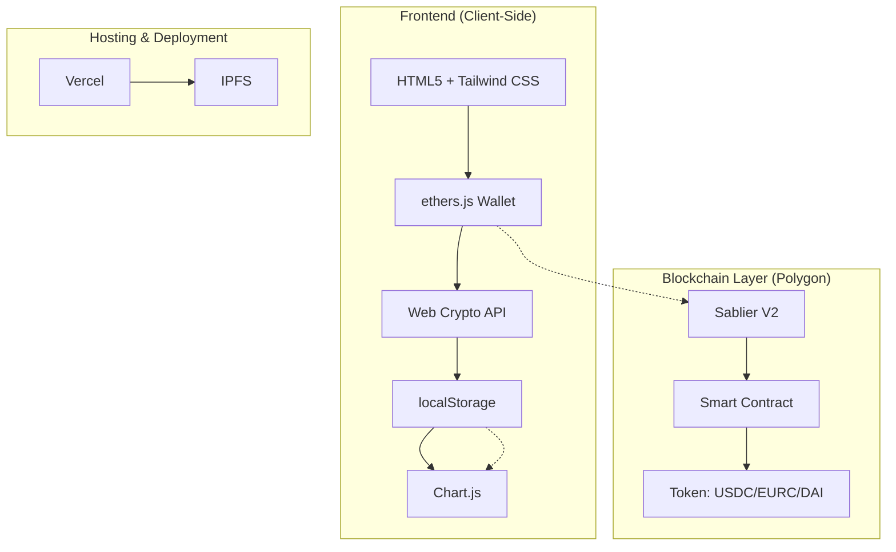

# Analisi del Progetto: Caveau Digitale

## Panoramica del Progetto

**Caveau Digitale** è una Progressive Web App (PWA) non-custodial che implementa un protocollo di risparmio inviolabile su blockchain Polygon. L'applicazione trasforma la forza di volontà in un vincolo matematico attraverso smart contract di time-locking.

## Architettura del Sistema

## Componenti Principali

### 1. **Gestione Wallet (Non-Custodial)**
- Generazione seed phrase BIP39 in-browser
- Cifratura locale con Web Crypto API (PBKDF2 + AES-GCM)
- Derivation chiavi da PIN (120.000 iterazioni)

### 2. **Sistema di Sicurezza**
- PIN locale cifrato con PBKDF2 + AES-GCM 256-bit
- Vault cifrati con chiave derivata dalla seed phrase
- Zero trust: sviluppatore non ha accesso a dati utente

### 3. **Time-Locking Protocol**
- Integrazione con Sablier V2 su Polygon
- Smart contract che risponde con REVERT a prelievi anticipati

### 4. **Interfaccia Utente**
- Schermate multiple: Welcome, Seed Creation, PIN Setup, Dashboard
- Modali per operazioni specifiche
- Grafici di progresso con Chart.js

## Tecnologie Utilizzate

| Componente | Tecnologia | Scopo |
|-----------|-------------|-------|
| Frontend | HTML5 + Tailwind CSS | Interfaccia utente |
| Wallet | ethers.js (BIP39) | Generazione seed phrase |
| Crittografia | Web Crypto API | Cifratura locale |
| Persistenza | localStorage (cifrato) | Nessun dato su server |
| Grafici | Chart.js | Visualizzazione progressi |
| Time-Lock | Sablier V2 / Polygon | Smart contract inviolabile |
| Hosting | Vercel / IPFS | Deploy statico, zero costi |

## Flusso di Lavoro

1. **Prima apertura**: Crea nuovo portafoglio → scrivi 12 parole → imposta PIN
2. **Crea vincolo**: Scegli obiettivo, importo target, valuta stabile, data sblocco
3. **Blocca fondi**: Esegui operazione su Sablier su rete Polygon
4. **Registra**: Inserisci importo versato → grafici si aggiornano
4. **Aspetta**: Countdown scende. La matematica fa il resto.

## Sicurezza Implementata

- **Non-Custodial**: chiavi private non lasciano mai dispositivo utente
- **PIN locale**: 6 cifre cifrate con PBKDF2 (120.000 iterazioni) + AES-GCM 256-bit
- **Vault cifrati**: metadati salvadanai cifrati con chiave derivata da seed phrase
- **Zero trust**: sviluppatore non ha accesso a nessun dato di nessun utente
- **Recupero**: perdita dispositivo → inserisci 12 parole → tutto ripristinato

## Deployment e Configurazione

- **Hosting**: Vercel e IPFS per hosting completamente decentralizzato
- **PWA**: installabile su smartphone senza App Store
- **Service Worker**: caching per funzionamento offline
- **Manifest**: configurazione per installazione app mobile

## Dipendenze Esterne

- ethers.js v6.7.1
- Chart.js v4.4.2
- Tailwind CSS (CDN)

## Stato Attuale

Progetto completamente funzionale con:
- Deploy live su piggyvault.xyz
- Versione IPFS permanente
- Integrazione completa con Polygon blockchain
- Supporto multi-valuta (USDC, EURC, DAI, USDT)